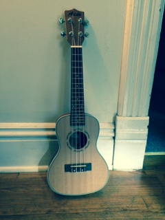
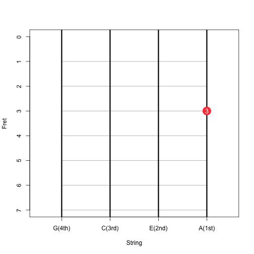
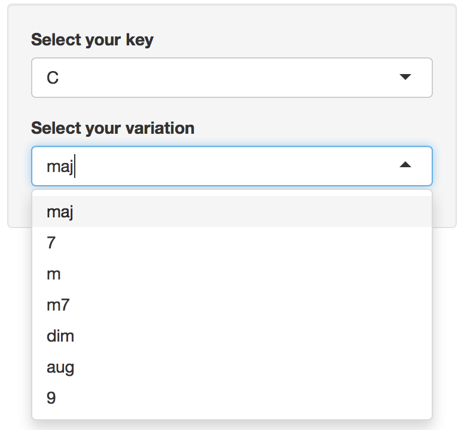
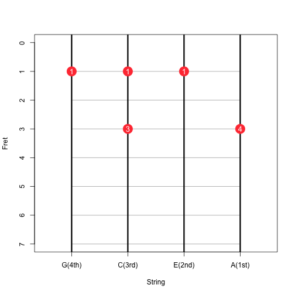

## Ukulele

Ukulele is known as the small Hawaiian guitar. 

This is my ukulele. Watch me playing the lava song on YouTube to have a better idea of how it works [www.youtube.com/watch?v=A9WM1bbxyfU].

---

## The C Chord

There are only four strings so ukulele is much easier to learn comparing to guitar. For example you only have to press the third fret on the first string to play the C major chord.

 

---
## uku chords

In [uku chords](https://fanhuan.shinyapps.io/uku_chords) you can select the chord you want by selecting the key and the variation.  

---

## Fingering
The numbers in the circles are fingering suggestings. 
* 1 for the index finger
* 2 for the middle finger
* 3 for the ring finger
* 4 for pinky 

So for the chord below (Fm7), it's not suggesting that you have 3 index fingers but pressing your index finger on the first fret to form a bar. This is the hardest chord you can get by the way. 

Enjoy!

 

